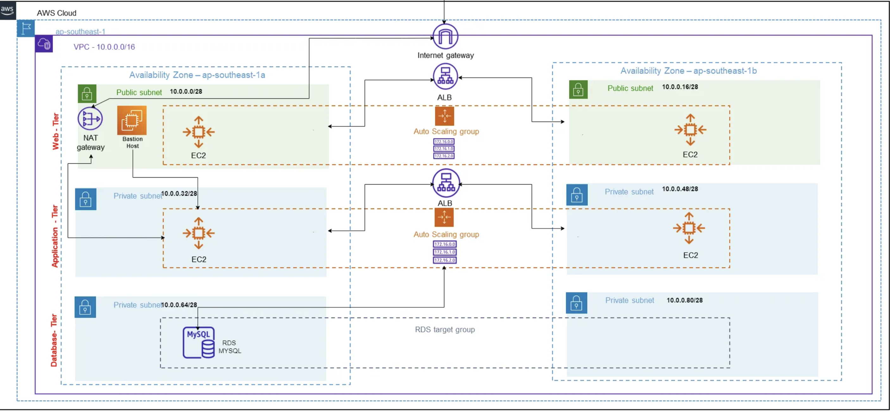

## Requirements

| Name | Version |
|------|---------|
|  [aws](#requirement\_aws) | ~>5 |

## Providers

No providers.

## Modules

| Name | Source | Version |
|------|--------|---------|
|  [network](#module\_network) | ../3Tier_Infrastructure/modules/network | n/a |
|  [tier-1](#module\_tier-1) | ../3Tier_Infrastructure/modules/1-tier | n/a |
|  [tier-2](#module\_tier-2) | ../3Tier_Infrastructure/modules/2-tier | n/a |
|  [tier-3](#module\_tier-3) | ../3Tier_Infrastructure/modules/3-tier | n/a |

## Resources

No resources.

## Inputs

No inputs.

## Outputs

No outputs.
## Requirements

Setup SM values for DB - user and password ( module 3-tier/secrets-manager.tf)

## Providers

| Name | Version |
|------|---------|
|  [aws](#provider\_aws) | n/a |

## Modules

No modules.

## Resources

| Name | Type |
|------|------|
| [aws_eip.three-tier-nat-eip](https://registry.terraform.io/providers/hashicorp/aws/latest/docs/resources/eip) | resource |
| [aws_internet_gateway.three-tier-igw](https://registry.terraform.io/providers/hashicorp/aws/latest/docs/resources/internet_gateway) | resource |
| [aws_nat_gateway.three-tier-natgw](https://registry.terraform.io/providers/hashicorp/aws/latest/docs/resources/nat_gateway) | resource |
| [aws_route_table.private-rt](https://registry.terraform.io/providers/hashicorp/aws/latest/docs/resources/route_table) | resource |
| [aws_route_table.public-rt](https://registry.terraform.io/providers/hashicorp/aws/latest/docs/resources/route_table) | resource |
| [aws_route_table_association.private-rt-assoc](https://registry.terraform.io/providers/hashicorp/aws/latest/docs/resources/route_table_association) | resource |
| [aws_route_table_association.public-rt-assoc](https://registry.terraform.io/providers/hashicorp/aws/latest/docs/resources/route_table_association) | resource |
| [aws_security_group.private_sg](https://registry.terraform.io/providers/hashicorp/aws/latest/docs/resources/security_group) | resource |
| [aws_security_group.public_sg](https://registry.terraform.io/providers/hashicorp/aws/latest/docs/resources/security_group) | resource |
| [aws_subnet.three-tier-pub-sub](https://registry.terraform.io/providers/hashicorp/aws/latest/docs/resources/subnet) | resource |
| [aws_subnet.three-tier-pvt-sub](https://registry.terraform.io/providers/hashicorp/aws/latest/docs/resources/subnet) | resource |
| [aws_vpc.three-tier-vpc](https://registry.terraform.io/providers/hashicorp/aws/latest/docs/resources/vpc) | resource |
| [aws_availability_zones.available](https://registry.terraform.io/providers/hashicorp/aws/latest/docs/data-sources/availability_zones) | data source |

## Inputs

No inputs.

## Outputs

| Name | Description |
|------|-------------|
|  [aws\_eip\_id](#output\_aws\_eip\_id) | n/a |
|  [aws\_eip\_public\_ip](#output\_aws\_eip\_public\_ip) | n/a |
|  [aws\_igw\_id](#output\_aws\_igw\_id) | n/a |
|  [aws\_nat\_id](#output\_aws\_nat\_id) | n/a |
|  [aws\_security\_group\_private\_sg\_ids](#output\_aws\_security\_group\_private\_sg\_ids) | n/a |
|  [aws\_security\_group\_public\_sg\_ids](#output\_aws\_security\_group\_public\_sg\_ids) | n/a |
|  [aws\_subnet\_prv\_ids](#output\_aws\_subnet\_prv\_ids) | n/a |
|  [aws\_subnet\_pub\_1\_id](#output\_aws\_subnet\_pub\_1\_id) | n/a |
|  [aws\_subnet\_pub\_2\_id](#output\_aws\_subnet\_pub\_2\_id) | n/a |
|  [aws\_subnet\_pub\_ids](#output\_aws\_subnet\_pub\_ids) | n/a |
|  [aws\_subnet\_pvt\_1\_id](#output\_aws\_subnet\_pvt\_1\_id) | n/a |
|  [aws\_subnet\_pvt\_2\_id](#output\_aws\_subnet\_pvt\_2\_id) | n/a |
|  [aws\_subnet\_pvt\_3\_id](#output\_aws\_subnet\_pvt\_3\_id) | n/a |
|  [aws\_subnet\_pvt\_4\_id](#output\_aws\_subnet\_pvt\_4\_id) | n/a |
|  [aws\_vpc\_cidr\_block](#output\_aws\_vpc\_cidr\_block) | n/a |
|  [aws\_vpc\_id](#output\_aws\_vpc\_id) | VPC ID |
## Requirements

No requirements.

## Providers

| Name | Version |
|------|---------|
|  [aws](#provider\_aws) | n/a |

## Modules

No modules.

## Resources

| Name | Type |
|------|------|
| [aws_autoscaling_attachment.three-tier-web-asattach](https://registry.terraform.io/providers/hashicorp/aws/latest/docs/resources/autoscaling_attachment) | resource |
| [aws_autoscaling_group.three-tier-web-asg](https://registry.terraform.io/providers/hashicorp/aws/latest/docs/resources/autoscaling_group) | resource |
| [aws_launch_configuration.three-tier-web-lconfig](https://registry.terraform.io/providers/hashicorp/aws/latest/docs/resources/launch_configuration) | resource |
| [aws_lb.three-tier-web-lb](https://registry.terraform.io/providers/hashicorp/aws/latest/docs/resources/lb) | resource |
| [aws_lb_listener.three-tier-web-lb-listner](https://registry.terraform.io/providers/hashicorp/aws/latest/docs/resources/lb_listener) | resource |
| [aws_lb_target_group.three-tier-web-lb-tg](https://registry.terraform.io/providers/hashicorp/aws/latest/docs/resources/lb_target_group) | resource |
| [aws_ami.latest_ami](https://registry.terraform.io/providers/hashicorp/aws/latest/docs/data-sources/ami) | data source |

## Inputs

| Name | Description | Type | Default | Required |
|------|-------------|------|---------|:--------:|
|  [aws\_security\_group\_public\_sg\_ids](#input\_aws\_security\_group\_public\_sg\_ids) | ID's SG public subnet | `any` | n/a | yes |
|  [aws\_subnet\_pub\_ids](#input\_aws\_subnet\_pub\_ids) | Data public subnets | `list(string)` | n/a | yes |
|  [instance\_type](#input\_instance\_type) | Type of instance | `string` | `"t2.micro"` | no |
|  [key\_name](#input\_key\_name) | Name of key-pair | `string` | `"mykey"` | no |
|  [vpc\_id](#input\_vpc\_id) | VPC ID | `string` | n/a | yes |

## Outputs

No outputs.
## Requirements

No requirements.

## Providers

| Name | Version |
|------|---------|
|  [aws](#provider\_aws) | n/a |

## Modules

No modules.

## Resources

| Name | Type |
|------|------|
| [aws_autoscaling_group.three-tier-web-asg](https://registry.terraform.io/providers/hashicorp/aws/latest/docs/resources/autoscaling_group) | resource |
| [aws_launch_configuration.three-tier-mysql-lconfig](https://registry.terraform.io/providers/hashicorp/aws/latest/docs/resources/launch_configuration) | resource |
| [aws_ami.latest_ami](https://registry.terraform.io/providers/hashicorp/aws/latest/docs/data-sources/ami) | data source |

## Inputs

| Name | Description | Type | Default | Required |
|------|-------------|------|---------|:--------:|
|  [aws\_security\_group\_private\_sg\_ids](#input\_aws\_security\_group\_private\_sg\_ids) | ID's SG public subnet | `any` | n/a | yes |
|  [aws\_subnet\_prv\_ids](#input\_aws\_subnet\_prv\_ids) | Data private subnets | `list(string)` | n/a | yes |
|  [instance\_type](#input\_instance\_type) | Type of instance | `string` | `"t2.micro"` | no |
|  [key\_name\_db](#input\_key\_name\_db) | Name of key-pair | `string` | `"mykey"` | no |
|  [vpc\_id](#input\_vpc\_id) | VPC ID | `string` | n/a | yes |

## Outputs

No outputs.
## Requirements

No requirements.

## Providers

| Name | Version |
|------|---------|
|  [aws](#provider\_aws) | n/a |

## Modules

No modules.

## Resources

| Name | Type |
|------|------|
| [aws_db_instance.three-tier-db](https://registry.terraform.io/providers/hashicorp/aws/latest/docs/resources/db_instance) | resource |
| [aws_db_subnet_group.three-tier-db-sub-grp](https://registry.terraform.io/providers/hashicorp/aws/latest/docs/resources/db_subnet_group) | resource |
| [aws_secretsmanager_secret.db_password](https://registry.terraform.io/providers/hashicorp/aws/latest/docs/data-sources/secretsmanager_secret) | data source |
| [aws_secretsmanager_secret.db_user](https://registry.terraform.io/providers/hashicorp/aws/latest/docs/data-sources/secretsmanager_secret) | data source |
| [aws_secretsmanager_secret_version.db_password_version](https://registry.terraform.io/providers/hashicorp/aws/latest/docs/data-sources/secretsmanager_secret_version) | data source |
| [aws_secretsmanager_secret_version.db_user_version](https://registry.terraform.io/providers/hashicorp/aws/latest/docs/data-sources/secretsmanager_secret_version) | data source |

## Inputs

| Name | Description | Type | Default | Required |
|------|-------------|------|---------|:--------:|
|  [aws\_security\_group\_private\_sg\_ids](#input\_aws\_security\_group\_private\_sg\_ids) | SG ids | `any` | n/a | yes |
|  [aws\_subnet\_pvt\_3\_id](#input\_aws\_subnet\_pvt\_3\_id) | ID Private Subnet 3 | `any` | n/a | yes |
|  [aws\_subnet\_pvt\_4\_id](#input\_aws\_subnet\_pvt\_4\_id) | ID Private Subnet 4 | `any` | n/a | yes |
|  [db\_instance\_class](#input\_db\_instance\_class) | Instance Type | `string` | `"db.t2.micro"` | no |

## Outputs

No outputs.
